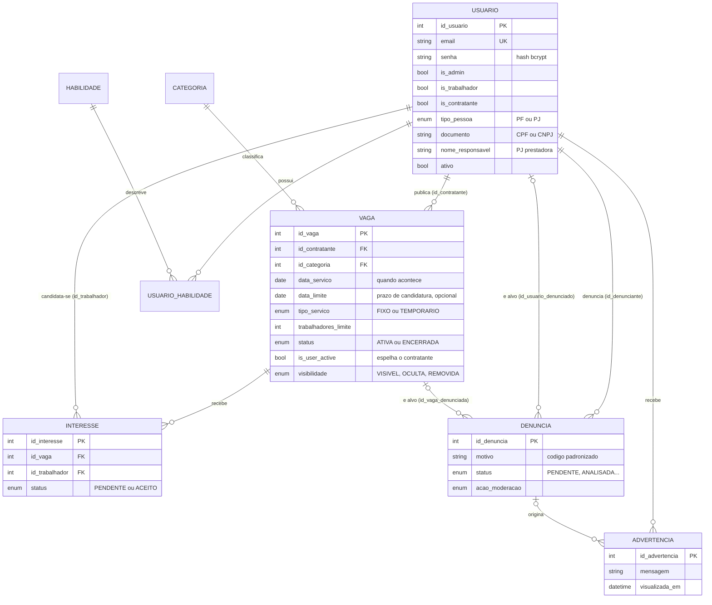
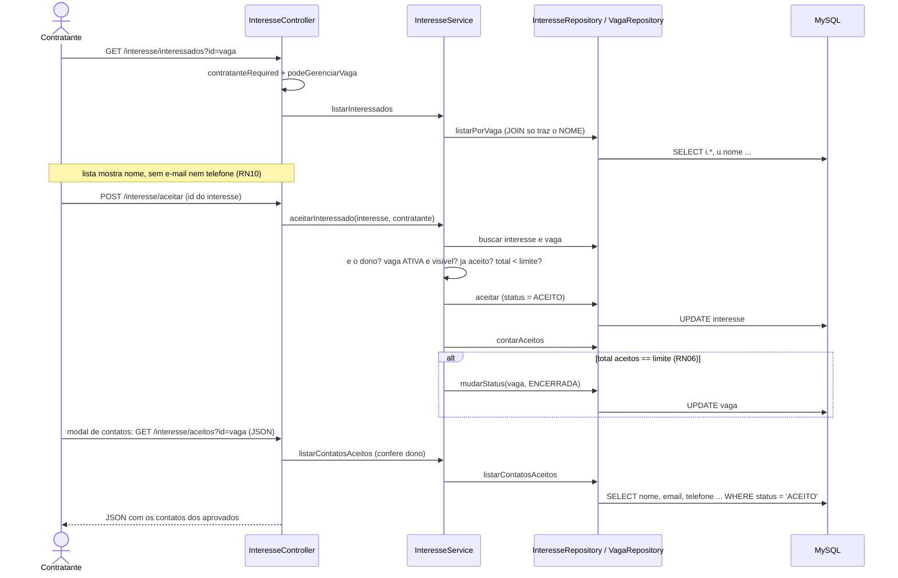
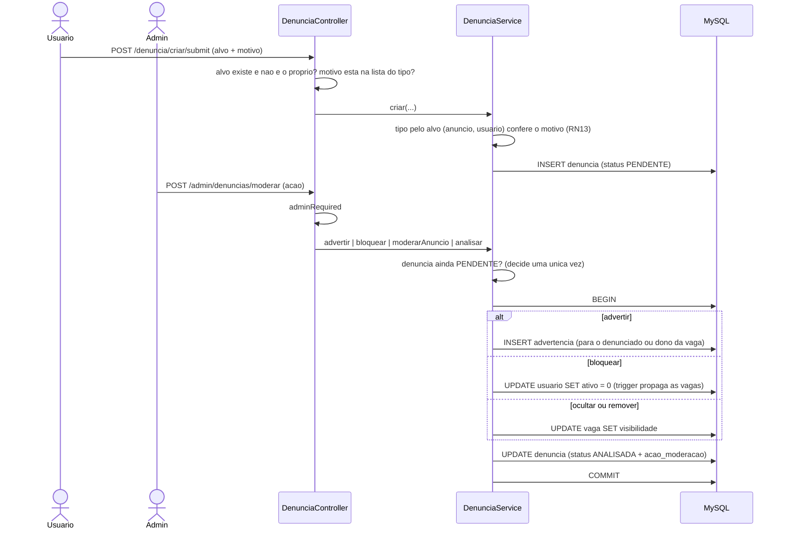

# FreelaJá: guia para entender e defender o código

Este documento existe para que você consiga explicar o sistema de cabeça, sem decorar arquivo por arquivo. Tudo o que está aqui foi conferido no código do repositório; onde algo não pôde ser confirmado, está escrito "não confirmado". As referências entre parênteses (`arquivo:linha` ou só `arquivo`) servem para você abrir e conferir.

Uma advertência de método: os números de linha mudam quando alguém edita o arquivo. Se uma linha citada não bater, procure o nome do método ao lado dela.

---

## 1. Visão geral em uma página

**O que é.** O FreelaJá é uma plataforma web que conecta quem precisa de um serviço pontual (o **contratante**) a quem presta esse serviço (o **trabalhador**). O contratante publica uma **vaga** (anúncio), trabalhadores demonstram **interesse** (candidatura), o contratante **seleciona** quem quiser e só então recebe o contato do escolhido. Um **administrador** modera a plataforma por meio de **denúncias**. O sistema não tem pagamento: ele apenas aproxima as partes.

**Decisão arquitetural central.** É um monólito em **PHP puro** com **MVC próprio**, sem framework, sem Composer e sem ORM. O roteador, o carregador de classes e o controller base foram escritos pela equipe (`app/core/`). A regra que organiza tudo é a divisão em cinco camadas com uma responsabilidade cada: o **controller** recebe a requisição e valida a entrada, o **service** decide as regras de negócio, o **repository** fala SQL, o **model** carrega os dados, e a **view** só desenha HTML. O banco é **MySQL** acessado por **PDO** com consultas parametrizadas.

**Tamanho.** São 69 arquivos PHP com cerca de 10,5 mil linhas, mais 14 arquivos SQL (o `script.sql` e 13 migrations) com cerca de 600 linhas. Há 33 rotas, 8 tabelas e 2 triggers. Aproximadamente 1,4 mil linhas (13%) são código morto que não roda; a seção 9 diz exatamente quais. Não há testes automatizados (não encontrei nenhum diretório ou arquivo de teste).

**Se a banca pedir "descreva seu sistema", uma resposta de cabeça:** *"É uma plataforma de vagas de serviços pontuais em PHP com MVC próprio. Toda requisição entra por um único arquivo, `public/index.php`, que registra as rotas; o roteador escolhe um controller; o controller confere quem é o usuário e valida a entrada; o service aplica as regras de negócio, como limite de trabalhadores, candidatura duplicada e liberação de contato só após a seleção; o repository executa SQL parametrizado no MySQL; e uma view renderiza o resultado. Um usuário pode ser trabalhador, contratante, ambos ou administrador, representado por três flags no banco. A moderação é feita por denúncias, com advertência, ocultação, remoção e bloqueio, sem apagar dados."*

---

## 2. O caminho de uma requisição

O melhor jeito de entender a estrutura é seguir uma requisição real do começo ao fim. Vamos acompanhar este caso: **um trabalhador clica em "Demonstrar interesse" na página de uma vaga**.

### 2.1 Da porta de entrada ao roteador

1. O navegador envia `POST /interesse/demonstrar` com o campo `id_vaga`. O formulário está em `app/views/vaga/vaga_show.php`.
2. **`.htaccess` da raiz.** O Apache reescreve tudo para a pasta `public/`. Só `public/` fica exposta como raiz do site; o resto do código (`app/`) não é servido diretamente.
3. **`public/.htaccess`.** Se o caminho pedido não for um arquivo ou diretório real (como uma imagem ou um upload), a requisição é reescrita para `public/index.php`. Por isso existe um único ponto de entrada.
4. **`public/index.php`** faz, nesta ordem: carrega o autoload (`app/core/Autoload.php`), carrega a configuração (`app/config/Config.php`), registra um tratador global de exceções, cria o `Router`, declara as 33 rotas e chama `$router->run()`.
   - O **autoload** converte um nome de classe em caminho de arquivo: `app\services\VagaService` vira `app/services/VagaService.php`. É por isso que os namespaces espelham as pastas.
   - O **`Config.php`** carrega o `.env` na mão, define as constantes de banco (`DB_HOST`, `DB_NAME`, etc.), configura a sessão (cookie `httponly`, `secure` só se a requisição for HTTPS, `use_strict_mode`), define o fuso `America/Sao_Paulo`, inicia a sessão e calcula `URL_BASE` a partir do host da requisição.
5. **`app/core/Router.php`.** O método `run()` normaliza a URI, procura uma rota cujo caminho **e** método HTTP batam exatamente, e chama `dispatch()`. O roteador só faz correspondência exata: **não existe parâmetro na URL**. Por isso os identificadores viajam sempre na query string (`?id=3`) ou no corpo do POST (`id_vaga`). Se nada casar, renderiza `errors/404.php`. Ao casar, `dispatch()` faz `new InteresseController` e chama o método `demonstrar`.

### 2.2 Controller: autenticação e permissão

O construtor do controller (`app/controllers/InteresseController.php`) cria seus services, e cada service cria seus repositories; o repository pega a conexão PDO única em `ConnectionFactory::getConnection()`. Ou seja, a conexão com o banco nasce quando o controller é instanciado.

O método `demonstrar()` começa com `$this->trabalhadorRequired()`. Esse é o **ponto onde autenticação e permissão são verificadas**, e ele vive no controller base (`app/core/Controller.php`):

- `trabalhadorRequired()` chama primeiro `autenticacaoRequired()`, que faz três coisas: confere se há usuário na sessão; confere se o IP e o navegador da sessão são os mesmos do login; e **recarrega o usuário do banco** para ver se a conta ainda está ativa (RN04). Se falhar em qualquer uma, redireciona para `/login`. Se passar, substitui o usuário da sessão pelo recém-lido, o que também atualiza papéis alterados.
- Depois, `trabalhadorRequired()` verifica o **papel**: passa quem é trabalhador ou administrador. Caso contrário, redireciona para `/403`.

Em seguida o controller lê `id_vaga`, converte para inteiro e chama o service. Ele **não decide nenhuma regra**; só entrega a entrada e escolhe a resposta.

### 2.3 Service: as regras

`InteresseService::demonstrarInteresse` (`app/services/InteresseService.php`) é onde a decisão acontece. Ele busca a vaga e aplica, em ordem: a vaga existe; o contratante está ativo e a vaga não foi ocultada pela moderação; a vaga está `ATIVA`; o prazo de candidatura não passou; o trabalhador não é o dono da vaga (RN08); e ele ainda não se candidatou (RN16). Qualquer falha lança uma exceção com mensagem de negócio.

### 2.4 Repository e banco

Só se todas as regras passam, o service monta um `Interesse` e o entrega a `InteresseRepository::criar`, que executa o **`INSERT` com parâmetros nomeados** (`:vaga`, `:trabalhador`, ...) e devolve o id. É o **único lugar onde o SQL acontece** nesse fluxo. Antes disso, `VagaRepository::buscarPorId` também faz SQL (com `JOIN` em `categoria` e `COUNT` de aceitos).

Como rede de segurança final, o banco tem `UNIQUE(id_vaga, id_trabalhador)` na tabela `interesse`: mesmo que duas requisições passassem juntas pela checagem do service, a segunda seria rejeitada pelo MySQL.

### 2.5 De volta: a resposta

O controller captura qualquer exceção e faz `redirect` para `/vagas/visualizar?id=...` (o padrão do projeto é *Post/Redirect/Get*: depois de um POST, redireciona para um GET). Note que, neste fluxo específico, o motivo da recusa **não é mostrado ao usuário**: o `catch` só redireciona. Isso é uma limitação que aparece na seção 10.

O GET seguinte cai em `VagaController::visualizar`, que repete `autenticacaoRequired()`, carrega a vaga e chama `$this->view('vaga/vaga_show', [...])`.

### 2.5.1 Como as views são renderizadas neste projeto

Não há motor de templates. `Controller::view()` (`app/core/Controller.php`) faz, em sequência: busca as advertências pendentes do usuário logado; transforma uma chave `erro` em `erros['geral']`; chama `extract($data)`, que transforma cada chave do array em uma variável local (`$vaga`, `$usuario`, ...); e faz `require_once` do arquivo em `app/views/`. A view, portanto, enxerga essas variáveis como se fossem dela.

Cada view abre com `include` do `shared/header.php` e do `shared/navbar.php` e fecha com `include` do `shared/footer.php`: o "layout" é feito por inclusão manual, não por herança. O `navbar.php` lê `$_SESSION` diretamente para saber quem está logado. Como é `require_once`, uma view só é renderizada uma vez por requisição.

### 2.6 O caminho, resumido

```
navegador
  → .htaccess (raiz)            reescreve para public/
  → public/.htaccess            tudo que não é arquivo vai para index.php
  → public/index.php            autoload, Config, rotas
  → app/core/Router.php         casa método + caminho, instancia o controller
  → InteresseController         autenticacaoRequired + trabalhadorRequired   ← autenticação e permissão
  → InteresseService            regras de negócio                            ← decisão
  → InteresseRepository         INSERT parametrizado                         ← SQL
  → MySQL                       UNIQUE(id_vaga, id_trabalhador)              ← última barreira
  → redirect → VagaController::visualizar → Controller::view → vaga_show.php
```

---

## 3. As camadas e a regra de ouro de cada uma

A ideia é simples: **cada camada tem uma pergunta que ela responde, e só essa**. Quando você abrir um arquivo, sabe o que esperar.

| Camada | Pergunta que responde | Nunca deve aparecer |
|---|---|---|
| Controller | "O que chegou e quem pediu? O que respondo?" | SQL; regra de negócio |
| Service | "Isto é permitido pelas regras do negócio?" | `$_POST`, `$_SESSION`, HTML, SQL |
| Repository | "Como isso é lido ou gravado no banco?" | Regra de negócio; HTML |
| Model | "Que dados isto carrega?" | SQL; conhecimento de tela |
| View | "Como isso aparece?" | SQL; regra de negócio |

### Controller (`app/controllers/`)
Recebe `$_GET`/`$_POST`, chama os guardas de acesso, **valida o formato da entrada** (campo obrigatório, tamanho, data válida), chama um service e escolhe entre renderizar uma view ou redirecionar. O melhor exemplo é `VagaController::criar`/`editar`: as regras de campo do formulário (título de 2 a 100 caracteres, remuneração numérica, data não anterior a hoje) estão centralizadas em `validarDadosVaga`, e as duas ações a reutilizam. O controller não sabe *por que* uma vaga não pode mudar de título; só chama o service.

### Service (`app/services/`)
É o **coração do sistema**. Aplica as regras de negócio e orquestra repositories. O exemplo clássico é `InteresseService::aceitarInteressado`: confere que quem aceita é o dono da vaga, que a vaga está aberta, que o candidato ainda não foi aceito, que o limite de trabalhadores não foi atingido, grava o aceite e, se com esse aceite o limite foi atingido, **encerra a vaga automaticamente** (RN06). Nenhuma dessas decisões está no controller nem na view.

### Repository (`app/repositories/`)
Todo o SQL do sistema vive aqui, sempre com parâmetros (`bindValue`), e devolve models. Exemplo: `VagaRepository::buscar` monta a consulta de busca adicionando cláusulas `AND` conforme os filtros recebidos, sempre vinculando os valores como parâmetros. Perceba o cuidado com o SQL dinâmico: só o *formato* da consulta muda; os valores do usuário nunca são concatenados.

### Model (`app/models/`)
Objetos simples que carregam dados e expõem perguntas derivadas. `Vaga::estaDisponivel()` resume três condições (status `ATIVA`, contratante ativo, não oculta pela moderação) em um único método. `Denuncia` também guarda as listas de motivos padronizados como constantes. Um model não fala com o banco.

### View (`app/views/`)
HTML com PHP para repetir e condicionar. Recebe variáveis prontas do controller. Toda saída de dado do usuário passa por `htmlspecialchars` (proteção contra XSS).

### Onde a separação foi quebrada (prefira saber antes da banca)
Sendo honesto, há exceções que você deve conhecer:

1. **`AutenticacaoService::logar`** (`app/services/AutenticacaoService.php`) escreve em `$_SESSION` e lê `$_SERVER`. Um service "puro" não conheceria a sessão; aqui o service faz login *e* guarda a sessão.
2. **O núcleo depende de services.** `Controller::view()` chama `AdvertenciaService` e `autenticacaoRequired()` chama `UsuarioService` (`app/core/Controller.php`). O controller base, que deveria ser infraestrutura, conhece regras de duas áreas. É prático, mas acopla o núcleo.
3. **Services controlam transação.** `DenunciaService` e `UsuarioService::definirHabilidades` usam `ConnectionFactory::getConnection()` para `beginTransaction`/`commit`. Ou seja, código de infraestrutura de banco dentro de service. Só funciona porque todos os repositories compartilham a mesma conexão PDO estática. O ideal seria um "gerenciador de transação" separado.
4. **Permissão por dono no controller.** A checagem "esta vaga é sua?" (`podeGerenciarVaga`, `app/core/Controller.php`) mora no controller, enquanto outras regras equivalentes (como `listarContatosAceitos`) moram no service. A permissão de acesso está espalhada nas duas camadas.
5. **Lógica de apresentação com regra dentro da view.** `vaga_show.php` decide o rótulo do status ("Aberta", "Encerrada", "Oculta pela moderação") usando os métodos do model; é apresentação, mas depende de regras.
6. **Montagem de dados no controller.** `InteresseController::historico` monta uma lista juntando interesse, vaga e contratante, consultando o service **uma vez por item** (o clássico "N+1").

---

## 4. Autenticação, sessão e permissão

### 4.1 Cadastro e armazenamento da senha
`AutenticacaoController::cadastrar` valida os campos e chama `UsuarioService::registrar`, que confere se o e-mail já existe e grava a senha com `password_hash($senha, PASSWORD_BCRYPT, ['cost' => 12])` (`app/services/UsuarioService.php`). O bcrypt gera um hash com **sal embutido e custo ajustável**: o custo 12 significa que cada verificação é deliberadamente lenta, o que dificulta ataques de força bruta se o banco vazar. A senha em texto puro nunca é gravada. O banco guarda só o hash em `usuario.senha` (`VARCHAR(255)`).

### 4.2 Login
`AutenticacaoController::logar` → `AutenticacaoService::logar`:
1. busca o usuário **ativo** pelo e-mail (`UsuarioRepository::buscarAtivoPorEmail`, com `WHERE ativo = 1`);
2. compara com `password_verify` (que refaz o hash com o mesmo sal e compara);
3. chama `session_regenerate_id(true)`, que troca o identificador da sessão para evitar *session fixation*;
4. guarda na sessão o objeto do usuário, o IP e o `User-Agent`.

### 4.3 Como a sessão é protegida
- **Cookie**: `httponly` (JavaScript não lê o cookie), `secure` quando a requisição é HTTPS, e `use_strict_mode` (o PHP recusa identificadores de sessão que ele não criou). (`app/config/Config.php`)
- **Amarração ao cliente**: a cada requisição autenticada, o IP e o navegador precisam ser os do login (`Controller::autenticacaoRequired`). Se mudarem, a sessão é destruída. Efeito colateral: quem troca de rede no celular precisa entrar de novo.
- **Conta viva**: a cada requisição o usuário é relido do banco. Se foi bloqueado depois de logar, cai na hora e vê "Sua conta está desativada". Custo: uma consulta por chave primária por requisição.

### 4.4 O mecanismo de guardas
O controller base (`app/core/Controller.php`) tem quatro guardas, todas no início do método do controller:

| Guarda | Deixa passar |
|---|---|
| `autenticacaoRequired()` | qualquer usuário logado e ativo |
| `trabalhadorRequired()` | trabalhador ou admin |
| `contratanteRequired()` | contratante ou admin |
| `adminRequired()` | somente admin |

Elas fazem o redirecionamento e interrompem a execução. O padrão de leitura é: **abriu um método de controller, a primeira linha diz quem pode chamá-lo**. Note que o administrador passa nas guardas de trabalhador e de contratante; isso é a regra "administrador acessa tudo" (RN15).

Para permissão **por objeto** (não só por perfil), há `podeGerenciarVaga`: verdadeiro se o usuário é admin ou é o dono da vaga. É usado para editar, excluir, ver interessados. Repare no limite deliberado: admin gerencia vagas, mas **não** ganha os contatos dos aprovados (RN12) nem aceita candidatos por outra pessoa.

### 4.5 O sistema de papéis
Uma pessoa pode ser **trabalhador**, **contratante**, **ambos** ou **administrador**. No banco, isso são três colunas booleanas em `usuario`: `is_admin`, `is_trabalhador`, `is_contratante` (`app/database/scripts/script.sql`). Duas restrições `CHECK` protegem a integridade:

- `chk_usuario_tem_papel`: a soma das três flags é pelo menos 1 (toda conta tem algum papel);
- `chk_usuario_pj_papel_unico`: uma empresa (`tipo_pessoa = 'PJ'`) **não** pode ser trabalhador e contratante ao mesmo tempo. Só pessoa física acumula (RN02).

O papel é *independente* do tipo de pessoa: `tipo_pessoa` (`PF` ou `PJ`) diz se o documento é CPF ou CNPJ; as flags dizem o que a pessoa faz na plataforma. O cadastro escolhe os papéis por *checkbox* e o servidor valida a combinação em `Validador::papeis`; o administrador nunca é criado por formulário.

---

## 5. O modelo de dados

### 5.1 A história em uma frase
Um **usuário** (contratante) publica uma **vaga** de uma **categoria**; outros **usuários** (trabalhadores) demonstram **interesse** nela; a plataforma modera por **denúncias**, que podem gerar **advertências**; e trabalhadores têm **habilidades**.

### 5.2 Diagrama



(A tabela `INTERESSE` tem ainda `UNIQUE(id_vaga, id_trabalhador)`, descrita abaixo.)

### 5.3 Entidades centrais
- **`usuario`**: a pessoa (ou empresa). Guarda identidade, papéis, tipo de pessoa e se está ativa. É o pivô do sistema: quase toda tabela aponta para ele.
- **`vaga`**: o anúncio. É a tabela mais rica e a que mais evoluiu (8 das 13 migrations mexem nela).
- **`interesse`**: a candidatura, a relação entre um trabalhador e uma vaga. É uma tabela associativa **com estado próprio** (`PENDENTE` ou `ACEITO`).
- **`denuncia`**: o registro de uma queixa e da decisão da moderação sobre ela.

### 5.4 Entidades de apoio
- **`categoria`** e **`habilidade`**: listas de referência (10 valores cada, populadas pelo `script.sql`). Não há tela para gerenciá-las.
- **`usuario_habilidade`**: tabela de ligação muitos-para-muitos entre usuário e habilidade, com **chave primária composta** `(id_usuario, id_habilidade)`. Isso já impede repetir a mesma habilidade para a mesma pessoa. Uma pessoa tem várias habilidades e uma habilidade pertence a várias pessoas; por isso uma tabela intermediária em vez de uma coluna. Só faz sentido para trabalhadores (regra aplicada no service, não no banco).
- **`advertencia`**: a advertência enviada pela moderação, com um campo `visualizada_em` que registra quando o advertido a dispensou.

### 5.5 As chaves estrangeiras que realmente importam
| FK | Comportamento | O que protege |
|---|---|---|
| `vaga.id_contratante → usuario` | `CASCADE` | apagar um usuário apaga suas vagas (nunca sobra vaga sem dono) |
| `interesse.id_vaga → vaga` | `CASCADE` | apagar a vaga leva as candidaturas junto |
| `interesse.id_trabalhador → usuario` | `CASCADE` | idem para o trabalhador |
| `vaga.id_categoria → categoria` | sem cascata (restringe) | não se apaga categoria em uso |
| `denuncia.id_usuario_denunciado`, `id_vaga_denunciada` | `SET NULL` | **a denúncia sobrevive** mesmo que o alvo seja apagado (evidência) |
| `advertencia.id_denuncia`, `id_moderador` | `SET NULL` | o histórico da advertência não some se a denúncia ou o moderador sumirem |

A lógica por trás: dados **dependentes** (candidaturas, habilidades) somem junto com o dono (`CASCADE`); dados que servem de **registro histórico** (denúncias, advertências) sobrevivem (`SET NULL`).

### 5.6 Decisões de modelagem que você precisa saber justificar

**(a) `data_servico` separada de `data_limite`.** São dois conceitos diferentes. `data_servico` é o **dia em que o trabalho acontece** (obrigatória, não pode estar no passado). `data_limite` é o **prazo para se candidatar** (opcional, RN05). Uma vaga pode aceitar candidaturas até quinta-feira para um serviço de sábado. Usar um único campo obrigaria a escolher um dos dois significados. A separação também permite filtrar a busca "a partir de uma data" pela data do serviço, e permite regras como "só registrar não comparecimento depois da data do serviço".

**(b) `UNIQUE(id_vaga, id_trabalhador)` em `interesse`** (`uk_interesse`). Impede a candidatura duplicada (RN16) **no próprio banco**. O service também confere antes, para dar uma mensagem clara, mas a garantia de verdade é a do banco: se duas requisições simultâneas passarem pela checagem, a segunda falha no `INSERT`. Regra de integridade crítica deve ficar onde não dá para contornar.

**(c) Os estados de moderação da vaga.** Não misturei tudo em um único campo. Existem três eixos independentes, cada um com o seu significado:
- `status` (`ATIVA`/`ENCERRADA`): a **vontade do contratante** ou o limite atingido;
- `is_user_active`: o **dono está ativo?** (espelho de `usuario.ativo`, mantido por trigger);
- `visibilidade` (`VISIVEL`/`OCULTA`/`REMOVIDA`): a **decisão da moderação**.

A vaga só aparece na listagem se os três estiverem favoráveis (`Vaga::estaDisponivel`). Separar os eixos evita, por exemplo, que reabrir uma vaga desfaça uma ocultação da moderação. `OCULTA` some da listagem mas o dono ainda vê e pode corrigir; `REMOVIDA` também trava o dono, sem apagar nada.

**(d) A representação dos papéis.** Três flags booleanas em vez de uma tabela de papéis (justificativa na seção 8), protegidas por `CHECK`.

**(e) O vínculo usuário–habilidade.** Tabela associativa com chave composta, regravada em bloco dentro de uma transação (`UsuarioService::definirHabilidades`): ou grava o conjunto novo inteiro, ou mantém o anterior.

### 5.7 O que o banco faz sozinho (triggers)
Dois triggers mantêm `vaga.is_user_active` sincronizado com `usuario.ativo`: um depois de atualizar `usuario` (propaga bloqueio ou reativação às vagas do dono) e outro antes de inserir `vaga` (a vaga já nasce com o valor certo). A vantagem é que vale para **qualquer origem** de mudança (aplicação, painel, SQL manual). O custo: criar trigger exige privilégio `SUPER` quando o log binário está ligado, o que afeta a instalação (seção 10).

### 5.8 Como o esquema evolui
O `script.sql` cria um banco novo já no estado atual; as migrations `001` a `013` (`app/database/migrations/`) levam um banco **existente** ao mesmo estado, na ordem numérica. Regra de trabalho do projeto: toda alteração de schema entra como migration nova **e** no `script.sql`. Não há um executor de migrations: aplicar é manual.

---

## 6. Os fluxos principais

### 6.1 Cadastro e login
**Quem dispara:** visitante em `/cadastro`; depois em `/login`.

**Cadastro** (`AutenticacaoController::cadastrar`):
1. lê os campos, incluindo `papeis[]`, `tipo_pessoa` e `documento`;
2. valida no servidor com `Validador` (`app/helpers/Validador.php`): nome, e-mail, senha de no mínimo 8 caracteres, ao menos um papel, PJ com um só papel, telefone com DDD, documento obrigatório e coerente (CPF para PF, CNPJ para PJ, com verificação dos dígitos), e responsável quando for empresa prestadora;
3. `UsuarioService::registrar` verifica e-mail repetido (a coluna também é `UNIQUE`), gera o hash bcrypt e grava;
4. faz login automático e redireciona para `/perfil`.

**Login** (`AutenticacaoController::logar`): valida formato, chama `AutenticacaoService::logar` (seção 4.2) e redireciona para `/vagas`.

**Regras protegidas:** RN01 (tipos de perfil, responsável), RN02 (papel duplo só para PF), RN03 (dados obrigatórios).

### 6.2 Publicação de uma vaga
**Quem dispara:** contratante (ou admin) em `/vagas/criar`.
1. `contratanteRequired()` (autenticação, conta ativa e papel);
2. o controller normaliza a entrada (a remuneração aceita vírgula ou ponto) e roda `validarDadosVaga`: título 2–100, descrição 10–1000, local 2–150, data do serviço obrigatória e não anterior a hoje, horário `hh:mm`, tipo de serviço fixo/temporário, duração obrigatória só se temporário, observações até 500, remuneração numérica real;
3. `VagaService::criar` monta o model e chama `VagaRepository::criar`, que faz o `INSERT`;
4. o trigger `BEFORE INSERT` define `is_user_active` a partir do dono;
5. `redirect` para a página da vaga. Se o banco falhar, o usuário vê uma mensagem genérica e o detalhe vai para o log (`Controller::mensagemAmigavel`).

**Regras protegidas:** RN04 (só contratante autenticado e ativo publica) e RN05 (prazo opcional). **Ponto-chave:** todas as validações estão no servidor; o `required` do HTML só ajuda a pessoa.

### 6.3 Busca e filtro de vagas
**Quem dispara:** qualquer usuário logado em `/vagas/buscar`.
1. `VagaController::buscar` lê palavra-chave, localização, tipo de serviço, data e faixa de valor;
2. valida cada filtro: o tipo só aceita os dois valores do domínio; a data precisa ter formato válido; a faixa precisa ser numérica, não negativa e com mínimo não maior que o máximo. **Filtro inválido é ignorado e o usuário recebe um aviso**, em vez de a busca falhar;
3. `VagaRepository::buscar` monta o SQL: as condições **fixas** (`status = 'ATIVA'`, `is_user_active = 1`, `visibilidade = 'VISIVEL'`) estão sempre presentes, e cada filtro válido acrescenta um `AND` com parâmetro.

**Regra protegida:** RN07 (só vagas ativas, com os filtros previstos). As condições fixas são o que garante que uma vaga oculta ou de um dono bloqueado **nunca** apareça, independentemente do que a pessoa digite.

### 6.4 Candidatura do trabalhador
É o exemplo da seção 2. Resumo: guarda de trabalhador → `demonstrarInteresse` (vaga disponível, prazo, não é a própria vaga, sem duplicidade) → `INSERT` em `interesse` com `PENDENTE`. **Regras:** RN08, RN16 (com o `UNIQUE` como rede final). O trabalhador acompanha o resultado em `/interesse/historico` (RN09).

### 6.5 Aceite do candidato e liberação do contato


**O ponto central:** o contato só sai do banco por **uma consulta** (`InteresseRepository::listarContatosAceitos`), que filtra `status = 'ACEITO'`, e só depois de o service confirmar que quem pede é o dono da vaga. A lista de candidatos, por sua vez, é montada por uma consulta que **nem seleciona** e-mail e telefone. Ou seja, o contato não está escondido por CSS ou por JavaScript: ele simplesmente não é lido antes da hora. **Regras:** RN10, RN11, RN12, RN06.

### 6.6 Denúncia e moderação


**Como ler:** a denúncia tem sempre um **alvo**, que pode ser um usuário, um anúncio ou (no caso de não comparecimento) o usuário *e* a vaga juntos. O tipo do alvo define a lista de **motivos permitidos** (`Denuncia::MOTIVOS_ANUNCIO` e `MOTIVOS_USUARIO`, RN13). A moderação decide **uma única vez** por denúncia; cada ação é uma transação, então ou tudo acontece (sanção e registro da decisão) ou nada.

As ações: **advertir** cria uma `advertencia` que aparece no topo das páginas do advertido até ele dispensar; **bloquear** desativa a conta, e o trigger propaga a desativação às vagas; **ocultar** e **remover** mudam `vaga.visibilidade` **sem apagar nada**; **analisar** encerra a denúncia sem sanção. Para uma denúncia de anúncio, advertir e bloquear recaem sobre o **dono da vaga**, resolvido pelo servidor. O painel só mostra as ações que fazem sentido para cada tipo de alvo, e o service recusa as demais. **Regras:** RN13, RN14, RN17.

---

## 7. As regras de negócio no código

| Regra | Onde é imposta | Camada |
|---|---|---|
| RN01 três perfis; empresa prestadora exige responsável | `Validador::documentoPorTipoPessoa` e `responsavelPrestadora`; `AutenticacaoController::cadastrar`; colunas `tipo_pessoa`, `nome_responsavel` | Controller + banco |
| RN02 PF pode ser trabalhador e contratante | `Validador::papeis`; `CHECK chk_usuario_pj_papel_unico` (`script.sql`); `UsuarioController::editarPerfil` | Controller + banco |
| RN03 dados obrigatórios do perfil | `AutenticacaoController::cadastrar` (nome, e-mail, senha, telefone, documento, papéis) | Controller |
| RN04 só contratante autenticado e ativo cria anúncio | `Controller::contratanteRequired` e `autenticacaoRequired` (relê `ativo`); trigger `is_user_active` | Núcleo + banco |
| RN05 prazo limite opcional | `vaga.data_limite` aceita nulo; `VagaController::validarDadosVaga` só valida formato se enviado | Banco + Controller |
| RN06 encerra ao atingir o limite | `InteresseService::aceitarInteressado` | Service |
| RN07 busca com filtros, só vagas ativas | `VagaController::buscar`; `VagaRepository::buscar` | Controller + Repository |
| RN08 só trabalhador; não na própria vaga | `Controller::trabalhadorRequired`; `InteresseService::demonstrarInteresse` | Núcleo + Service |
| RN09 trabalhador acompanha candidaturas | `InteresseController::historico`; `views/interesse/historico.php` | Controller + View |
| RN10 só candidatos das próprias vagas; contato oculto | `InteresseController::listarInteressados`; `InteresseRepository::listarPorVaga` (só o nome) | Controller + Repository |
| RN11 selecionados não excedem o limite | `InteresseService::aceitarInteressado` | Service |
| RN12 contato liberado só ao contratante da vaga | `InteresseService::listarContatosAceitos`; `InteresseRepository::listarContatosAceitos` | Service + Repository |
| RN13 denúncia com motivo obrigatório e distinto | `Denuncia::MOTIVOS_*`; `DenunciaController::denunciar`; `DenunciaService::criar` | Model + Controller + Service |
| RN14 moderação (advertir, ocultar/remover, bloquear) | `DenunciaService` (`advertir`, `bloquearPorDenuncia`, `moderarAnuncio`); `DenunciaController::moderar` | Service |
| RN15 controle de acesso por tipo; admin acessa tudo | guardas e `podeGerenciarVaga` em `app/core/Controller.php` | Núcleo |
| RN16 sem candidatura duplicada | `UNIQUE uk_interesse`; `InteresseService::demonstrarInteresse` | Banco + Service |
| RN17 não comparecimento via denúncia | `DenunciaService::validarNaoComparecimento` e `registrarNaoComparecimento`; rotas `/denuncia/nao-comparecimento` | Service |
| RN18 editar com candidaturas sem mudar função/tipo | `VagaService::atualizar` com `VagaRepository::possuiCandidaturas` | Service |

**O princípio.** Regra de negócio mora no **service** (e, quando é de integridade, também no banco) por três razões. Primeiro, o service é o **único caminho comum**: se hoje a candidatura vem de um formulário e amanhã de uma API, as duas passam pelo mesmo `demonstrarInteresse`, e a regra não precisa ser reescrita. Segundo, controller e view mudam com a tela; a regra do negócio não deveria mudar com a tela. Terceiro, e mais importante: **o navegador é território do usuário**. Qualquer regra que exista só no HTML ou no JavaScript pode ser burlada com um `curl`, com as ferramentas do navegador ou editando o formulário. Se "só o dono aceita candidatos" estivesse apenas em esconder o botão, qualquer pessoa poderia enviar o POST diretamente e aceitar quem quisesse. Por isso o código repete a verificação no servidor: o HTML só melhora a experiência (o `required`, o botão desabilitado), mas quem garante é o service. O exemplo mais claro deste projeto: no formulário de edição de vaga, o título fica somente leitura quando há candidaturas, mas isso é só uma dica visual; a recusa de verdade acontece em `VagaService::atualizar`.

---

## 8. Decisões de projeto e suas justificativas

**MVC próprio em vez de um framework (Laravel, Symfony).**
*Alternativa descartada:* um framework completo. *Motivo:* o projeto é acadêmico e um dos objetivos é **entender e demonstrar** como uma requisição vira uma resposta; um framework esconderia justamente isso. O escopo é pequeno (33 rotas), então o custo de escrever roteador e autoload (menos de 400 linhas em `app/core/`) é baixo. O preço honesto: recursos que um framework dá prontos, como proteção CSRF, injeção de dependências, migrations executáveis e testes, tiveram que ser feitos à mão ou ficaram de fora (seção 10).

**Papéis por flags em vez de tabela N:N de papéis.**
*Alternativa descartada:* tabelas `papel` e `usuario_papel`. *Motivo:* são apenas três papéis fixos, sem previsão de novos. A checagem de papel roda **em toda requisição**, e com flags é um atributo do usuário já carregado (sem `JOIN`). O código já falava em `isAdmin/isTrabalhador/isContratante`. Além disso, regras como "empresa não acumula papéis" viram um `CHECK` simples de uma linha. *Custo:* se surgirem muitos papéis novos, a tabela N:N escala melhor.

**Soft delete na moderação (ocultar/remover) em vez de exclusão.**
*Alternativa descartada:* apagar a vaga denunciada. *Motivo:* uma denúncia é uma **evidência**. Apagar a vaga destruiria a prova e as candidaturas (por `CASCADE`). Mantendo o registro, o administrador pode revisar depois, e o dono pode corrigir uma vaga apenas oculta. O dono não pode excluir uma vaga moderada, para não fugir da moderação apagando a prova.

**Advertência visível em vez de apenas registrada.**
*Alternativa descartada:* só gravar a advertência. *Motivo:* uma advertência que ninguém vê não tem efeito: o objetivo dela é **comunicar** ao usuário. Por isso ela aparece no topo das páginas do advertido até ele clicar em "Entendi", e a data da leitura fica registrada. *Custo:* uma consulta a mais por página renderizada.

**`data_servico` separada de `data_limite`.**
*Alternativa descartada:* um único campo de data. *Motivo:* são dois conceitos (quando o trabalho acontece; até quando se aceita candidatura), com regras diferentes (uma é obrigatória e não pode estar no passado, a outra é opcional). Ver 5.6(a).

**Ausência de módulo de pagamento (decisão de escopo).**
*Alternativa descartada:* integrar um gateway (pix, cartão). *Motivo:* a documentação do projeto prevê explicitamente que o sistema **não tenha funcionalidade de pagamento**; a plataforma apenas aproxima as partes. Como a negociação e o acerto do valor acontecem fora dela (isto é uma consequência do escopo, não algo que o código implemente), o sistema não lida com dados financeiros, o que reduz risco legal e de segurança e mantém o escopo viável. O campo `remuneracao` é apenas informativo. Confirmei que não há nenhum código de pagamento no repositório.

**PHP puro, sem Composer nem dependências externas.**
*Motivo:* simplicidade de instalação e nenhuma dependência para manter. *Custo:* nada de biblioteca pronta (por exemplo, para envio de imagens em nuvem); o upload de foto foi feito com as funções nativas do PHP.

**Regras de integridade no banco, não só no código.**
Triggers para `is_user_active`, `UNIQUE` para candidatura e `CHECK` para papéis. *Motivo:* o código pode ter um erro ou ser contornado; o banco garante o mínimo sempre. *Custo:* triggers exigem privilégio `SUPER` para serem criados.

**Motivos de denúncia como constantes no model, não como tabela.**
*Alternativa descartada:* uma tabela `motivo_denuncia`. *Motivo:* as listas são pequenas e fixas (quatro motivos por tipo, definidos na documentação); constantes são mais simples e ficam versionadas no código. *Custo:* mudar a lista exige alterar código, não só dados.

---

## 9. Mapa do repositório

### 9.1 Ordem sugerida de leitura (a espinha dorsal)
1. `public/index.php`: as 33 rotas em uma página. Diz **o que o sistema faz**.
2. `app/core/Router.php` e `app/core/Autoload.php`: como a requisição é despachada.
3. `app/core/Controller.php`: guardas, `view()`, permissões, tratamento de erro. É o arquivo mais importante do núcleo.
4. `app/database/scripts/script.sql`: o modelo de dados inteiro, com triggers e `CHECK`.
5. `app/services/InteresseService.php`: as regras mais importantes do negócio.
6. `app/controllers/VagaController.php` + `app/services/VagaService.php` + `app/repositories/VagaRepository.php`: um fluxo completo nas três camadas.
7. `app/services/DenunciaService.php`: moderação e transações.
8. `app/helpers/Validador.php`: as regras de formato usadas por todos os controllers.

### 9.2 Onde cada coisa vive
| Caminho | O que vive ali | Quando abrir |
|---|---|---|
| `public/index.php` | ponto de entrada, rotas, tratador global de erros | descobrir qual controller atende uma URL |
| `public/.htaccess`, `.htaccess` | reescrita de URLs para o front controller | entender o roteamento no Apache |
| `public/uploads/` | fotos de perfil enviadas (com `.htaccess` que impede execução) | problema com foto |
| `public/img/` | logo e favicon | trocar identidade visual |
| `app/config/Config.php` | `.env`, constantes, sessão, fuso, `URL_BASE` | problema de conexão, sessão ou URL |
| `app/core/` | roteador, autoload, controller base | entender como tudo se liga |
| `app/controllers/` | um controller por área (autenticação, vaga, interesse, denúncia, usuário, advertência, erro) | ver o que uma ação faz e quem pode chamá-la |
| `app/services/` | regras de negócio | **descobrir por que algo é permitido ou recusado** |
| `app/repositories/` | todo o SQL | mudar uma consulta |
| `app/models/` | objetos de dados e constantes de domínio | ver os campos de uma entidade |
| `app/helpers/Validador.php` | validações de formato reutilizáveis | mudar uma regra de campo |
| `app/views/` | telas (Tailwind via CDN); `shared/` tem cabeçalho, menu e rodapé | mudar uma tela |
| `app/database/scripts/script.sql` | esquema completo e dados de exemplo | instalação nova |
| `app/database/migrations/` | evolução do esquema, `001` a `013` | atualizar um banco existente |
| `app/database/ConnectionFactory.php` | conexão PDO única; `DatabaseInitializer.php` cria o banco se não existir | problema de conexão |

### 9.3 Código morto ou sem rota (não perca tempo estudando)
Cerca de 1,4 mil linhas do repositório não rodam. Conferi por busca de referências:

| Arquivo | Situação |
|---|---|
| `app/controllers/CandidaturaController.php`, `app/services/CandidaturaService.php`, `app/repositories/CandidaturaRepository.php`, `app/models/Candidatura.php` | um módulo antigo de candidatura, **substituído por `Interesse*`**. Nenhuma rota chama o controller. Não confunda "candidatura" (`Interesse`) com esse módulo. |
| `app/services/HumoristaService.php` | referencia `Humorista` e `HumoristaRepository`, que **não existem**. Sobra de outro projeto. |
| `app/models/Empresa.php`, `app/models/UsuarioHabilidade.php`, `app/models/Categoria.php` | models sem nenhum uso. (A "empresa" hoje é `tipo_pessoa = 'PJ'`.) |
| `app/database/ConnectionFactor.php` | versão antiga (com erro de digitação) de `ConnectionFactory.php`; sem uso. |
| `app/views/usuarios/` (3 views) | telas antigas em Bootstrap, sem rota nem controller. |
| `app/views/denuncia/denuncia_list.php` | antiga lista de denúncias; a ativa é `listar.php`. |
| `app/views/interesse/confirmada.php`, `sucesso.php` | usadas apenas pelo módulo `Candidatura` morto. |
| `VagaController::encerrar` e `reabrir` | métodos completos, **sem rota** em `index.php`. |
| `UsuarioController::exibirCadastro` e `cadastrar` | sem rota; só redirecionam. |
| `InteresseController::visualizarHistorico` | tem rota, mas renderiza `interesse/visualizar_historico`, **view que não existe**. |

---

## 10. Limitações conhecidas

Esta seção existe para você responder "sim, eu sei disso, e a solução seria X". Elas estão ordenadas do mais grave ao menos grave.

1. **Sem proteção CSRF.** Nenhum formulário POST tem token (busca por "csrf" no código: zero ocorrências). *Impacto:* um site malicioso poderia fazer o navegador de um usuário logado enviar uma requisição, por exemplo excluir uma vaga. O cookie `httponly` e a amarração de sessão não impedem isso. *Correção:* gerar um token por sessão, incluí-lo em cada formulário e conferi-lo no controller base.

2. **`InteresseController::aceitar` sem guarda e sem transação.** O método não chama nenhuma guarda de acesso, e a sequência "conta aceitos, grava, reconta" não é atômica. *Impacto:* sem sessão, o método falha (o tratador global mostra a página 500); um usuário sem ser dono é barrado no service (`Sem permissão`), então a autorização real existe. Já a corrida é real: dois aceites simultâneos podem ultrapassar o limite de trabalhadores. *Correção:* chamar `contratanteRequired()` e envolver o aceite em transação com `SELECT ... FOR UPDATE` na vaga.

3. **Confirmação de senha não é validada no servidor.** Em `AutenticacaoController::cadastrar`, a linha `obrigatorio('confirma_senha', 'As senhas não coincidem.')` passa a *mensagem* como se fosse o *valor*, então nunca gera erro. *Impacto:* a confirmação só funciona se algum JavaScript conferir. *Correção:* comparar `$senha === $confirmaSenha` e registrar erro com `Validador::erro`.

4. **Logs com dados sensíveis.** Há 77 chamadas `error_log`, várias de depuração. `UsuarioController.php:126` grava o objeto do usuário inteiro, **incluindo o hash da senha**; outros gravam `$_POST`, e-mails de login e a lista de contatos aprovados (`InteresseController.php:169`). *Impacto:* quem tem acesso ao arquivo de log vê dados pessoais e hashes. *Correção:* remover os `print_r` de dados e usar um logger com níveis.

5. **Login diferencia "usuário inexistente" de "senha errada" e não limita tentativas.** Mensagens distintas (`AutenticacaoService::logar`) permitem descobrir quais e-mails existem, e não há bloqueio por tentativas. *Correção:* mensagem única ("credenciais inválidas") e limite de tentativas por IP/conta.

6. **`trabalhadores_limite` aceita 0 ou negativo.** O controller só faz `(int)`. *Impacto:* uma vaga com limite 0 quebra a lógica de encerramento (RN06). *Correção:* validar inteiro maior ou igual a 1.

7. **Dados gravados já escapados.** `cadastrar` e `editarPerfil` aplicam `htmlspecialchars` **antes** de gravar nome, telefone e documento, e as views escapam de novo. *Impacto:* um nome como `João & Filhos` pode aparecer como `João &amp; Filhos`. *Correção:* gravar o texto cru e escapar apenas na saída (como já foi feito nas denúncias).

8. **Localização do usuário é fixa no código.** `Usuario::getLocalizacao()` devolve sempre "Foz do Iguaçu, PR" (`app/models/Usuario.php`); a coluna `cidade` existe mas não é usada. *Correção:* ler de `cidade`.

9. **Desempenho e escala.** `VagaController::listar` aceita `limit`/`offset` da URL sem teto e não há paginação de verdade; o histórico do trabalhador faz uma consulta por item (N+1); a busca por texto usa `LIKE '%termo%'`, que não usa índice; e cada requisição autenticada faz uma consulta extra para revalidar a conta, além de outra para as advertências. *Correção:* teto e paginação, `JOIN` no histórico, índice `FULLTEXT`, e cache curto da conta.

10. **Front-end depende de CDN em tempo de execução.** O Tailwind é carregado de `cdn.tailwindcss.com` e as fontes do Google (`app/views/shared/header.php`). Sem internet, a página perde o estilo; e o Tailwind por CDN compila no navegador a cada visita. *Correção:* gerar o CSS em um build e servir arquivos locais.

11. **Instalação nova é frágil.** O `DatabaseInitializer` só roda o `script.sql` se o banco **ainda não existir**, e o usuário de aplicação normalmente não pode criá-lo. Além disso, criar os triggers exige `SUPER` com log binário ligado. *Impacto:* na prática, o esquema deve ser importado manualmente com um usuário privilegiado. Não há executor de migrations. *Correção:* um comando de instalação/migração documentado, ou um executor simples.

12. **Falha silenciosa na candidatura e no aceite.** Nos dois casos o controller engole a exceção e redireciona sem explicar. *Impacto:* o usuário não sabe por que não deu certo. *Correção:* mensagem flash de sessão.

13. **Não há ação para reexibir uma vaga oculta.** `OCULTA` só volta a `VISIVEL` por SQL. *Correção:* uma ação "reexibir" no painel.

14. **Amarração da sessão ao IP.** Quem troca de rede (comum no celular) é deslogado. É uma escolha de segurança com efeito colateral de usabilidade.

15. **Upload de imagem sem recodificação.** O PHP do ambiente não tem a extensão GD, então não dá para reprocessar a imagem. A defesa é validar o conteúdo, recusar arquivos com `<?php`, gerar nome aleatório e bloquear execução de scripts na pasta (`public/uploads/.htaccess`). *Correção:* recodificar a imagem com GD ou serviço de armazenamento externo.

16. **Sem testes automatizados** e cerca de 13% de código morto. *Correção:* testes de service (as regras) e limpeza do código morto listado na seção 9.3.

17. **Premissa minha no RN17.** O não comparecimento só pode ser registrado a partir da data do serviço. A documentação não fixa esse prazo; é uma decisão razoável, mas é uma decisão. Se a banca perguntar, diga que foi uma escolha para evitar acusações antes do dia combinado.

---

## 11. Perguntas prováveis da banca

**1. Por que você não usou um framework?**
Para demonstrar domínio do que acontece por baixo: roteamento, autoload, ciclo requisição-resposta. O escopo é pequeno o bastante para o custo ser baixo (o núcleo tem menos de 400 linhas). Reconheço o preço: CSRF, testes e migrations executáveis, que um framework daria prontos, ficaram pendentes (limitações 1, 11 e 16).

**2. Qual a diferença entre controller, service e repository? Não é tudo a mesma coisa?**
Não. O controller trata **HTTP** (o que chegou, quem pediu, o que responder). O service trata **regras do negócio** (o que é permitido). O repository trata **SQL**. Exemplo: para aceitar um candidato, o controller lê o id e chama o service; o service confere se quem aceita é o dono e se ainda há vaga; o repository só executa o `UPDATE`.

**3. Como você protege as senhas?**
Com `password_hash` em bcrypt, custo 12, que embute um sal aleatório por senha; a verificação é feita com `password_verify`. A senha em texto puro nunca é gravada. Ressalva honesta: hoje há um `error_log` que grava o objeto do usuário, com o hash, no log (limitação 4).

**4. Como você evita SQL injection?**
Todo SQL está nos repositories e usa parâmetros nomeados vinculados (`bindValue`). Mesmo no SQL dinâmico da busca, só o *formato* da consulta muda; os valores do usuário nunca são concatenados. Colunas que dependem de escolha (como o papel em `listarPorTipo`) vêm de uma lista fixa (`match`), nunca da entrada.

**5. E XSS?**
Toda saída de dado do usuário nas views passa por `htmlspecialchars`. O ponto fraco é o contrário: alguns campos são gravados já escapados (limitação 7), o que é um defeito de exibição, não de segurança.

**6. O sistema é protegido contra CSRF?**
Não, e eu sei disso (limitação 1). O cookie é `httponly` e a sessão é amarrada ao IP e ao navegador, mas isso não impede CSRF. A correção é um token por sessão em cada formulário, verificado no controller base.

**7. Uma regra só no JavaScript ou no HTML seria suficiente?**
Não: o cliente é controlado pelo usuário. Por isso toda validação e toda permissão são conferidas no servidor. O `required` e o botão escondido só melhoram a experiência. Exemplo: o título da vaga fica somente leitura no formulário quando há candidaturas, mas a recusa real está em `VagaService::atualizar`.

**8. Como você garante que o contato do trabalhador não vaza antes da seleção?**
Não é escondido por CSS: a consulta que lista candidatos nem seleciona e-mail e telefone. Só existe uma consulta que os lê, e ela filtra `status = 'ACEITO'` e exige, no service, que quem pede é o dono da vaga. O administrador também não os recebe (RN12).

**9. O que acontece se dois trabalhadores se candidatam ao mesmo tempo, ou o mesmo trabalhador clica duas vezes?**
O service confere se já existe candidatura, mas a garantia final é o `UNIQUE(id_vaga, id_trabalhador)` no banco: a segunda inserção falha. Já o aceite de candidatos **não** é atômico e pode ultrapassar o limite sob concorrência (limitação 2); a correção é transação com bloqueio de linha.

**10. Por que os papéis são flags e não uma tabela de papéis?**
São três papéis fixos, conferidos em toda requisição (sem `JOIN`), e regras como "empresa não acumula papéis" viram um `CHECK` de uma linha. Se os papéis crescessem e mudassem, a tabela N:N seria melhor.

**11. Por que existem `status`, `is_user_active` e `visibilidade` na vaga? Não é redundante?**
São três decisões diferentes: o contratante encerrou (ou o limite acabou), o dono foi bloqueado, a moderação ocultou. Separar evita que uma ação desfaça outra, por exemplo reabrir uma vaga cancelando uma ocultação da moderação. A vaga só aparece se as três estiverem favoráveis.

**12. Por que a moderação não apaga a vaga denunciada?**
Porque a denúncia é evidência e apagar destruiria a prova (e as candidaturas, por `CASCADE`). Ocultar preserva o registro e permite revisão. O dono também não pode excluir uma vaga moderada.

**13. O que acontece se o banco cair no meio de uma moderação?**
Cada ação de moderação é uma transação: a sanção e o registro da decisão acontecem juntos ou nenhum acontece. O usuário vê uma mensagem genérica e o detalhe vai só para o log. Uma exceção não tratada cai no tratador global e mostra uma página 500 sem detalhes.

**14. Como o sistema escalaria para muitos usuários?**
Hoje há limites claros: sem paginação de verdade, uma consulta extra por requisição para revalidar a conta, histórico com N+1 e busca com `LIKE`. Para escalar: paginação, `JOIN`s, índice `FULLTEXT`, cache curto da conta e um build de CSS. A estrutura em camadas facilita isso porque o SQL está isolado nos repositories.

**15. Por que não há pagamento?**
Decisão de escopo prevista na documentação: a plataforma apenas aproxima contratante e trabalhador, sem funcionalidade de pagamento. Isso evita risco legal e de segurança com dados financeiros. O campo de remuneração é informativo. Não há nenhum código de pagamento no repositório.

**16. Por que existe código que não roda?**
São restos de módulos antigos (`Candidatura*`, `Humorista*`, views em Bootstrap). Estão mapeados na seção 9.3 e a remoção é uma limpeza pendente. A honestidade aqui vale mais que negar: cerca de 13% do código é morto.

---

## 12. Glossário

- **Vaga / anúncio**: a oferta de serviço publicada pelo contratante. Tabela `vaga`.
- **Contratante**: quem publica vagas e escolhe candidatos.
- **Trabalhador / prestador**: quem se candidata e presta o serviço.
- **Interesse / candidatura**: a manifestação de um trabalhador por uma vaga. Tabela `interesse`. (Não confundir com o módulo morto `Candidatura*`.)
- **Aceito / selecionado**: candidato escolhido pelo contratante (`interesse.status = 'ACEITO'`); só então o contato é liberado.
- **Contato**: e-mail e telefone do trabalhador; liberado apenas ao contratante da vaga e apenas após a seleção (RN10, RN12).
- **PF / PJ**: pessoa física (CPF) / pessoa jurídica, ou empresa (CNPJ). Campo `tipo_pessoa`.
- **Papel**: o que a pessoa faz na plataforma (`is_trabalhador`, `is_contratante`, `is_admin`). Independente de PF/PJ.
- **Responsável**: pessoa indicada por uma empresa prestadora como executora do serviço (`nome_responsavel`).
- **`data_servico`**: dia em que o serviço acontece.
- **`data_limite`**: prazo opcional para se candidatar.
- **`status` da vaga**: `ATIVA` ou `ENCERRADA` (vontade do contratante ou limite atingido).
- **`is_user_active`**: espelho de `usuario.ativo` na vaga, mantido por trigger; vaga de dono bloqueado deixa de valer.
- **`visibilidade`**: decisão da moderação sobre a vaga: `VISIVEL`, `OCULTA` ou `REMOVIDA`.
- **Denúncia**: queixa contra um usuário, um anúncio ou (não comparecimento) ambos. Tabela `denuncia`.
- **Moderação**: análise do administrador sobre uma denúncia, com uma ação.
- **Advertência**: aviso da moderação a um usuário; aparece no topo das páginas até ser dispensado.
- **Soft delete**: tirar algo de circulação sem apagar o registro (é o caso de ocultar/remover).
- **Não comparecimento**: falta do trabalhador selecionado, registrada pelo contratante como denúncia (RN17).
- **Guarda (guard)**: método do controller base que barra quem não pode executar a ação (`autenticacaoRequired`, etc.).
- **Front controller**: o padrão em que toda requisição entra por um único arquivo (`public/index.php`).
- **Post/Redirect/Get**: depois de um POST, redirecionar para um GET, para evitar reenvio do formulário.
- **View**: arquivo PHP em `app/views/` que produz HTML.
- **Migration**: script SQL numerado que leva um banco existente ao esquema atual (`app/database/migrations/`).
- **Trigger**: rotina que o próprio MySQL executa ao inserir ou atualizar uma tabela.
- **`CHECK`**: restrição do banco que recusa linhas que violam uma condição (usada nos papéis).
- **PDO**: a extensão do PHP que fala com o MySQL; aqui, sempre com parâmetros vinculados.
- **bcrypt**: algoritmo de hash de senha, lento de propósito e com sal embutido.
- **CSRF**: ataque em que um site de terceiros faz o navegador do usuário enviar uma requisição em seu nome; este sistema ainda não tem defesa contra ele.
- **N+1**: consultar o banco uma vez por item de uma lista, em vez de uma só vez para todos.
